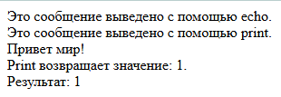
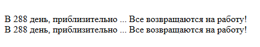
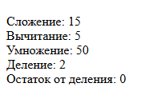
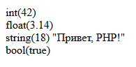

# Лабораторная работа №2

## Инструкции по запуску проекта

1. **Убедитесь, что PHP установлен:**
   Проверьте, что PHP доступен в терминале, выполнив команду:

   ```bash
   php -v
   ```

   Если PHP не установлен или команда не распознаётся:

   - Загрузите и установите последнюю версию PHP с [официального сайта](https://www.php.net/downloads).
   - Убедитесь, что путь к PHP добавлен в переменную окружения `PATH`.
   - Перезапустите терминал и повторите команду `php -v` для проверки.

2. **Перейдите в директорию проекта:**

   ```bash
   cd path/to/php_labs/lab_1
   ```

3. **Запустите встроенный сервер PHP:**
   Выполните команду:

   ```bash
   php -S localhost:8000
   ```

4. **Проверьте в браузере:**
   Откройте [http://localhost:8000](http://localhost:8000) для проверки работы проекта.

## Описание лабораторной работы

Целью лабораторной работы является изучение основ языка PHP, включая:

- Разницу между `echo` и `print`.
- Работа с переменными и операциями.
- Использование типов данных и функции `var_dump()`.
- Интеграция PHP с HTML.
- Вывод текстовых данных с форматированием.
- Основы документирования с использованием PHPDoc.

## Краткая документация к проекту

### Структура проекта

- **`index.php`:** главный файл приложения, содержащий весь код лабораторной работы.

### Основные элементы

1. **Вывод текста:** использование `echo` и `print` для вывода данных.
2. **Работа с переменными:** объявление и использование переменных различных типов.
3. **Арифметические операции:** выполнение базовых операций, таких как сложение, вычитание и остаток от деления.
4. **Интеграция с HTML:** использование PHP для динамического наполнения HTML.
5. **Форматирование текста:** вывод текстовых данных с сохранением отступов и переносов строк.
6. **PHPDoc-документация:** описание функций и основных элементов проекта.

## Примеры использования проекта

### Разница между `echo` и `print`

**Пример кода:**

```php
<?php
// Использование echo
echo "Это сообщение выведено с помощью echo.<br>";

// Использование print
print "Это сообщение выведено с помощью print.<br>";

// Пример нескольких параметров для echo
echo "Привет", " ", "мир!", "<br>";

// Print возвращает 1
$result = print "Print возвращает значение: 1.<br>";
echo "Результат: $result<br>";
?>
```

**Результат в браузере:**



---

### Работа с переменными и выводом

**Пример кода:**

```php
<?php
$days = 288;
$message = "Все возвращаются на работу!";

echo "В " . $days . " день, приблизительно ... " . $message . "<br>";
echo "В $days день, приблизительно ... $message<br>";
?>
```

**Результат в браузере:**



---

### Арифметические операции

**Пример кода**

```php
<?php
$a = 10;
$b = 5;

echo "Сложение: " . ($a + $b) . "<br>";
echo "Вычитание: " . ($a - $b) . "<br>";
echo "Умножение: " . ($a * $b) . "<br>";
echo "Деление: " . ($a / $b) . "<br>";
echo "Остаток от деления: " . $a % $b . "<br>";
?>
```

**Результат в браузере:**



---

### Типы данных

**Пример кода**

```php
<?php
$intVar = 42;
$floatVar = 3.14;
$stringVar = "Привет, PHP!";
$boolVar = true;

// Использование var_dump
var_dump($intVar);
echo "<br>";
var_dump($floatVar);
echo "<br>";
var_dump($stringVar);
echo "<br>";
var_dump($boolVar);
echo "<br>";
?>
```

**Результат в браузере:**



---

### Интеграция PHP и HTML

**Пример кода**

```php
<!DOCTYPE html>
<html lang="ru">
<head>
   <meta charset="UTF-8">
   <meta name="viewport" content="width=device-width, initial-scale=1.0">
   <title>Интеграция PHP и HTML</title>
</head>
<body>
   <h1>Добро пожаловать, <?php echo "гость"; ?>!</h1>
   <p>Сегодня: <?php echo date("Y-m-d"); ?></p>
</body>
</html>
```

**Результат в браузере:**


---

### Вывод стиха

**Пример кода**

```php
<!DOCTYPE html>
<html lang="ru">

<head>
  <meta charset="UTF-8">
  <meta name="viewport" content="width=device-width, initial-scale=1.0">
  <title>Стихотворение</title>
</head>

<body>
  <h1>Стихотворение</h1>
  <pre>
<?php
echo "На свете есть немало слов,\n";
echo "Что будят в сердце добрый свет.\n";
echo "Слова: \"мечта\", \"любовь\", \"весна\",\n";
echo "И каждое из них — ответ.\n\n";

echo "Слова несут тепло и радость,\n";
echo "Но в час тревоги и борьбы\n";
echo "Они дают душе отвагу,\n";
echo "И свет надежды средь судьбы.";
?>
    </pre>
</body>

</html>
```

**Результат в браузере:**


## Ответы на контрольные вопросы

1. **В чем разница между `echo` и `print`?**

   - `echo` быстрее и может принимать несколько аргументов.
   - `print` возвращает значение (1) и используется как выражение.

2. **Какие типы данных поддерживает PHP?**

   - Целое число (`int`).
   - Вещественное число (`float`).
   - Строка (`string`).
   - Булево значение (`bool`).
   - Массивы, объекты, ресурсы и `null`.

3. **Как встроить PHP в HTML?**
   - Необходимо использовать теги `<?php ... ?>` для вставки кода PHP в HTML.

## Список использованных источников

1. [Документация PHP](https://www.php.net/manual/ru/)
2. [Учебник PHP на W3Schools](https://www.w3schools.com/php/)
3. [Руководство по встроенному серверу PHP](https://www.php.net/manual/ru/features.commandline.webserver.php)

## Дополнительные важные аспекты

- В случае ошибок проверьте логи встроенного сервера, отображаемые в терминале.
