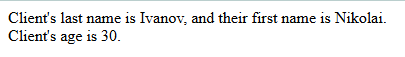

# Лабораторная работа №3

## Инструкции по запуску проекта

1. **Убедитесь, что PHP установлен:**
   Проверьте, что PHP доступен в терминале, выполнив команду:

   ```bash
   php -v
   ```

   Если PHP не установлен или команда не распознаётся:

   - Загрузите и установите последнюю версию PHP с [официального сайта](https://www.php.net/downloads).
   - Убедитесь, что путь к PHP добавлен в переменную окружения `PATH`.
   - Перезапустите терминал и повторите команду `php -v` для проверки.

2. **Перейдите в директорию проекта:**

   ```bash
   cd path/to/php_labs/lab_3
   ```

3. **Запустите встроенный сервер PHP:**
   Выполните команду:

   ```bash
   php -S localhost:8000
   ```

4. **Проверьте в браузере:**

   Откройте [http://localhost:8000](http://localhost:8000) для перехода на `index.php`.

   Откройте [http://localhost:8000/operator.php](http://localhost:8000/operator.php) для перехода на `operator.php`.

   Откройте [http://localhost:8000/schedule.php](http://localhost:8000/schedule.php) для перехода на `schedule.php`.

## Описание лабораторной работы

Цель лабораторной работы:

- Изучить работу условных операторов `if`, тернарного оператора и `switch`.
- Научиться анализировать код с использованием условий и функций для работы с датой.

## Краткая документация к проекту

### Структура проекта

Проект состоит из следующих файлов:

- **index.php**: главный файл для выполнения заданий 1 и 2.
- **operator.php**: файл для выполнения задания 3.
- **schedule.php**: файл для выполнения заданий 4 и 5.

### Основные элементы

**Задание 1**

1. Объявление переменных `$lastName`, `$firstName` и `$age`.
2. Вывод данных с помощью `echo` и `print`.

**Задание 2**

1. Использование условных операторов для анализа текущего дня недели.
2. Замена `if...else` на тернарный оператор.
3. Добавление ветки `elseif` и изменение условий с использованием числовых значений дня недели.

**Задание 3**

1. Использование `if` и `elseif` для анализа возраста.
2. Замена `if` на тернарный оператор для вывода сообщения.

**Задание 4**

1. Использование `switch` для обработки текущего дня недели.
2. Вывод сообщений с использованием функции `date()`.

**Задание 5**

1. Генерация таблицы с графиком работы на основе текущего дня недели.
2. Использование массивов для определения рабочих дней сотрудников.

## Примеры использования проекта

### Задание 1 (Переменные и вывод)

**Пример кода:**

```php
<?php
$lastName = 'Ivanov';
$firstName = 'Nikolai';
echo 'Client\'s last name is '.$lastName.', and their first name is '.$firstName.'.';

$age = 30;
print '<br>Client\'s age is '.$age.'.';
?>
```

**Результат в браузере:**



### Задание 2 (Условные операторы)

**Пример кода:**

```php
<?php
$currentDay = date("w");

if ($currentDay == 5) {
  echo "Have a great weekend!";
} elseif ($currentDay == 0) {
  echo "Tomorrow starts a new work week!";
} else {
  echo "Have a productive workday!";
}

echo "<br>";

// Тернарный оператор
echo ($currentDay == 5)
  ? "Have a great weekend!"
  : (($currentDay == 0) ? "Tomorrow starts a new work week!" : "Have a productive workday!");
?>
```

**Результат в браузере:**


### Задание 3 (Анализ возраста)

**Пример кода:**

```php
<?php
$age = 22;

if ($age > 12 && $age < 20) {
    $message = "you are a teenager!";
} elseif ($age > 40) {
    $message = "you are an adult!";
} else {
    $message = "you are in your prime... get to work!";
}

$name = "Anna";
echo $name ? $name.', '.$message : 'Anonymous, '.$message;
?>
```

**Результат в браузере:**


### Задание 4 (Использование switch)

**Пример кода:**

```php
<?php
$day = date("w");

switch ($day) {
    case 0:
        echo "Today is Sunday, ".date("d.m.Y");
        break;
    case 1:
        echo "Today is Monday, ".date("d.m.Y");
        break;
    case 2:
        echo "Today is Tuesday, ".date("d.m.Y");
        break;
    case 3:
        echo "Today is Wednesday, ".date("d.m.Y");
        break;
    case 4:
        echo "Today is Thursday, ".date("d.m.Y");
        break;
    case 5:
        echo "Today is Friday, ".date("d.m.Y");
        break;
    case 6:
        echo "Today is Saturday, ".date("d.m.Y");
        break;
    default:
        echo "Unknown day";
        break;
}
?>
```

**Результат в браузере:**


### Задание 5 (Таблица с графиком работы)

**Пример кода:**

```php
<?php
$day = date("w");
echo "<table border='1'>";
echo "<tr><th>№</th><th>Фамилия Имя</th><th>График работы</th></tr>";

// John Styles
if (in_array($day, [1, 3, 5])) {
    $scheduleJohn = "8:00-12:00";
} else {
    $scheduleJohn = "Нерабочий день";
}
echo "<tr><td>1</td><td>John Styles</td><td>$scheduleJohn</td></tr>";

// Jane Doe
if (in_array($day, [2, 4, 6])) {
    $scheduleJane = "12:00-16:00";
} else {
    $scheduleJane = "Нерабочий день";
}
echo "<tr><td>2</td><td>Jane Doe</td><td>$scheduleJane</td></tr>";

echo "</table>";
?>
```

**Результат в браузере:**


## Ответы на контрольные вопросы

1. **Что делают переменные `$lastName`, `$firstName` и `$age`?**

   - Хранят строковые или числовые значения для вывода данных о клиенте.

2. **Как выполняется вывод данных?**

   - С помощью операторов `echo` и `print`, объединяя строки с переменными.

3. **Что реализуют условные конструкции `if` и тернарный оператор?**

   - Анализируют условия и возвращают соответствующий результат.

4. **Какое значение принимает `$message`?**

   - Значение переменной `$message` зависит от возраста: если возраст от 13 до 19 лет, то `$message` будет "you are a teenager!", если возраст больше 40 лет — "you are an adult!", и в остальных случаях — "you are in your prime... get to work!".

## Список использованных источников

1. [Документация PHP](https://www.php.net/manual/ru/)
2. [Учебник PHP на W3Schools](https://www.w3schools.com/php/)
3. [Функция date() в PHP](https://www.php.net/manual/ru/function.date.php)

## Дополнительные важные аспекты

- Для запуска скриптов убедитесь, что порт 8000 не занят другими приложениями.
- Используйте функцию `var_dump()` для отладки переменных.
- В случае ошибок проверьте логи встроенного сервера, отображаемые в терминале.
