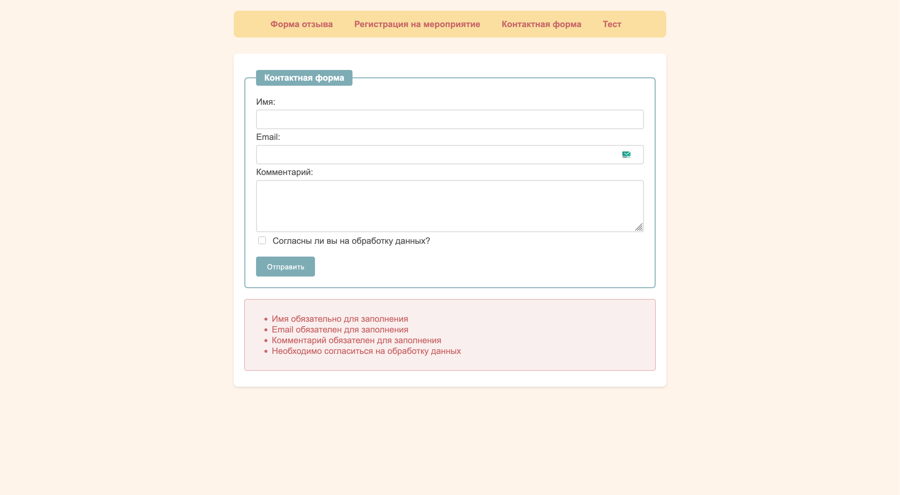

# Лабораторная работа №5 - Обработка форм

## Инструкции по запуску проекта

1. Убедитесь, что у вас установлены:
   - Ruby версии 3.0 или выше
   - Bundler (менеджер пакетов Ruby)

2. Установка и запуск:
   ```bash
   # Перейти в директорию проекта
   cd lab_5
   
   # Установить зависимости
   bundle install
   
   # Запустить сервер
   ruby app.rb
   ```

3. Откройте браузер и перейдите по адресу: `http://localhost:4567`

## Описание лабораторной работы

Цель работы: Изучение механизмов обработки веб-форм с использованием Ruby и фреймворка Sinatra, реализация валидации данных и работа с различными типами форм.

### Реализованные задачи:

1. Форма отзыва (`/` или `/review`)
   - Базовая обработка формы
   - Валидация email и обязательных полей
   - Отображение отправленных данных
   - Обработка ошибок

2. Регистрация на мероприятие (`/event`)
   - Работа с различными типами полей ввода
   - Сохранение данных при ошибке валидации
   - Поддержка множественного выбора опций

3. Контактная форма (`/contact`)
   - Программная валидация всех полей
   - Детальные сообщения об ошибках
   - Проверка формата email с валидацией домена
   - Валидация длины и содержимого имени (3-20 символов, без цифр)
   - Валидация длины комментария (10-1000 символов)
   - Обязательное согласие на обработку данных

4. Форма тестирования (`/quiz`)
   - Мультивопросный тест
   - Валидация заполнения всех вопросов

## Скриншоты работы приложения

### 1. Форма отзыва
#### Ошибки валидации


#### Успешная отправка


### 2. Форма регистрации на мероприятие
#### Успешная регистрация


### 3. Контактная форма
#### Ошибки валидации



#### Успешная отправка


### 4. Форма тестирования
#### Ошибки валидации


#### Результаты теста


## Краткая документация к проекту

### Структура проекта:
```
lab_5/
├── app.rb              # Основной файл приложения
├── config.ru           # Конфигурация Rack
├── Gemfile            # Зависимости проекта
└── views/             # Шаблоны представлений
    ├── layout.erb     # Основной шаблон
    ├── review.erb     # Форма отзыва
    ├── event.erb      # Форма регистрации
    ├── contact.erb    # Контактная форма
    └── quiz.erb       # Форма теста
```

### Основные компоненты:

1. Класс `FormValidator`:
```ruby
class FormValidator
  def self.validate_name(name)
    errors = []
    if name.nil? || name.empty?
      errors << "Имя обязательно для заполнения"
    else
      errors << "Имя должно быть не короче 3 символов" if name.length < 3
      errors << "Имя должно быть не длиннее 20 символов" if name.length > 20
      errors << "Имя не должно содержать цифр" if name.match?(/\d/)
    end
    errors
  end

  def self.validate_email(email)
    errors = []
    if email.nil? || email.empty?
      errors << "Email обязателен для заполнения"
    else
      begin
        address = Mail::Address.new(email)
        unless address.domain && address.address == email
          errors << "Неверный формат email адреса"
        end
        unless address.domain.include?('.')
          errors << "Неверный формат домена в email адресе"
        end
      rescue Mail::Field::ParseError
        errors << "Неверный формат email адреса"
      end
    end
    errors
  end
  # ... другие методы валидации
end
```

2. Обработка маршрутов:
```ruby
# Пример обработки POST-запроса с валидацией
post '/contact' do
  @name = params[:name]
  @email = params[:email]
  @comment = params[:comment]
  @agree = params[:agree]
  
  @errors = []
  @errors.concat(FormValidator.validate_name(@name))
  @errors.concat(FormValidator.validate_email(@email))
  @errors.concat(FormValidator.validate_comment(@comment))
  @errors.concat(FormValidator.validate_agreement(@agree))
  
  @form_submitted = true
  erb :contact
end
```

## Список использованных источников

1. [Sinatra Documentation](http://sinatrarb.com/documentation.html)
2. [Ruby Documentation](https://ruby-doc.org/)
3. [HTML Forms Guide](https://developer.mozilla.org/en-US/docs/Learn/Forms)